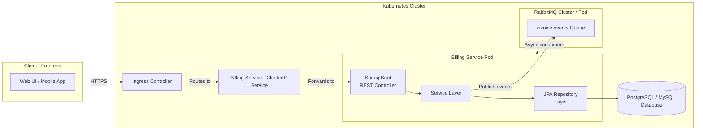
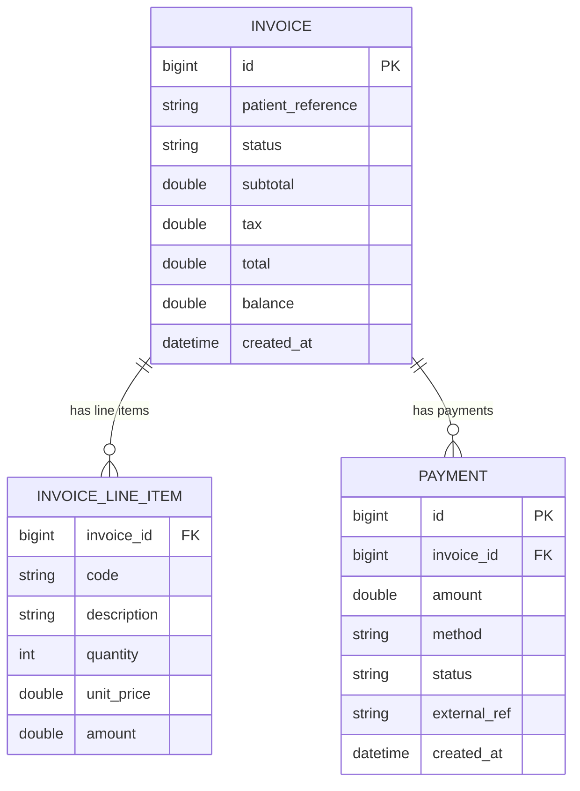

# Billing Service – Architecture & ER Diagrams

Welcome to the documentation for the **Billing Service**.  
This page shows two critical views of the system:

1. **Overall Service Architecture** (Spring Boot + RabbitMQ + Kubernetes + DB)  
2. **Entity Relationship Diagram (ERD)** for the billing domain

---

# 🚀 Architecture Diagram

---

# 📘 Entity Relationship Diagram (ERD)

---

## ✅ Notes

- This documentation is generated for GitHub Pages and fully supports Mermaid diagrams.
- Update this page anytime your architecture or domain entities change.
