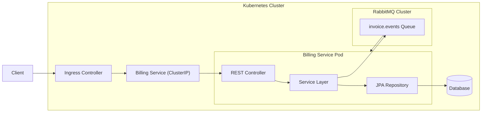
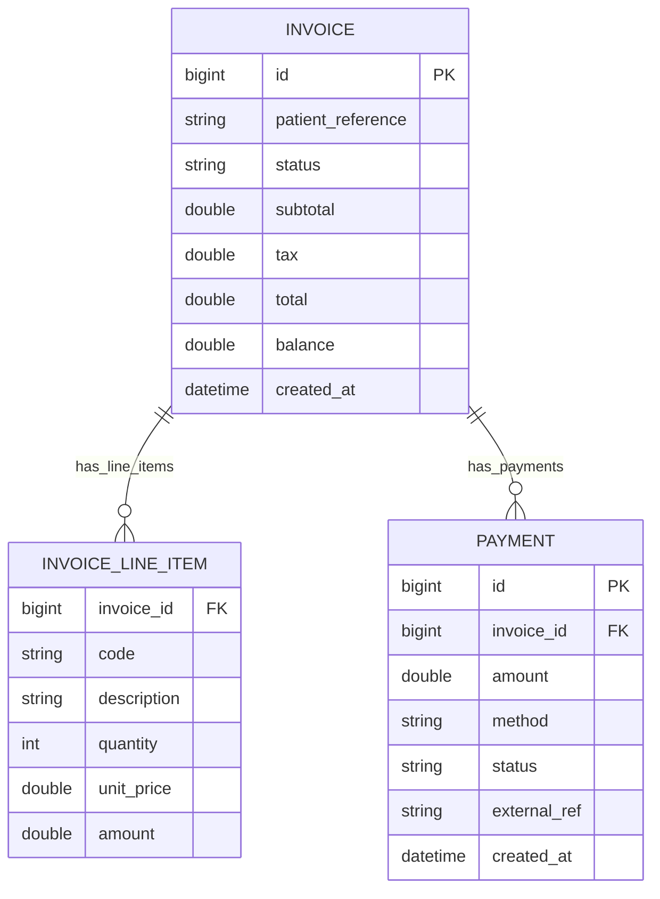

---

---

# Billing Service – Architecture & ER Diagrams

---

# Architecture Diagram

```mermaid
graph LR

    User[Client]

    subgraph K8s["Kubernetes Cluster"]
        Ingress["Ingress Controller"]
        SVC["Billing Service (ClusterIP)"]

        subgraph BillingPod["Billing Service Pod"]
            Ctrl["REST Controller"]
            SvcLayer["Service Layer"]
            Repo["JPA Repository"]
        end

        subgraph Rabbit["RabbitMQ Cluster"]
            Queue["invoice.events Queue"]
        end

        DB[(Database)]
    end

    User --> Ingress
    Ingress --> SVC
    SVC --> Ctrl
    Ctrl --> SvcLayer
    SvcLayer --> Repo
    Repo --> DB

    SvcLayer --> Queue
    Queue --> BillingPod
```

---

# Entity Relationship Diagram (ERD)

```mermaid
erDiagram

  INVOICE {
    bigint id PK
    string patient_reference
    string status
    double subtotal
    double tax
    double total
    double balance
    datetime created_at
  }

  INVOICE_LINE_ITEM {
    bigint invoice_id FK
    string code
    string description
    int quantity
    double unit_price
    double amount
  }

  PAYMENT {
    bigint id PK
    bigint invoice_id FK
    double amount
    string method
    string status
    string external_ref
    datetime created_at
  }

  INVOICE ||--o{ INVOICE_LINE_ITEM : has_line_items
  INVOICE ||--o{ PAYMENT : has_payments
```

---
