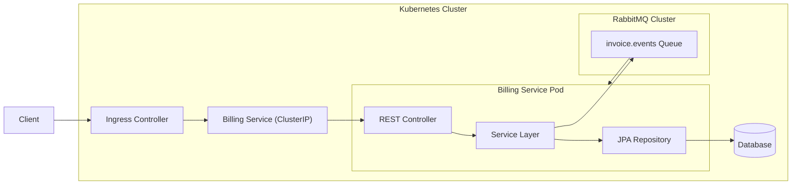
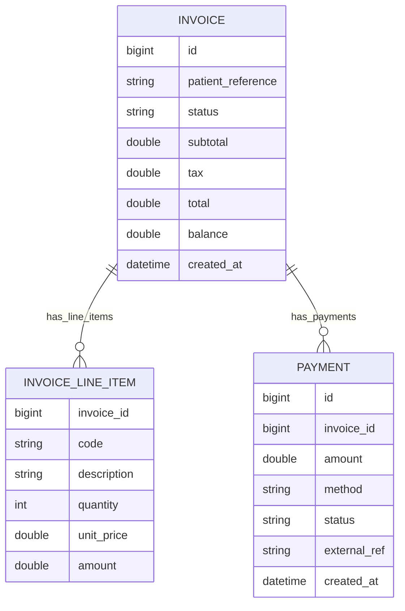

# Billing Service – Architecture & ER Diagrams

This page documents the high-level architecture and the billing domain model.

---

## Architecture Diagram

---

## Entity Relationship Diagram (ERD)

